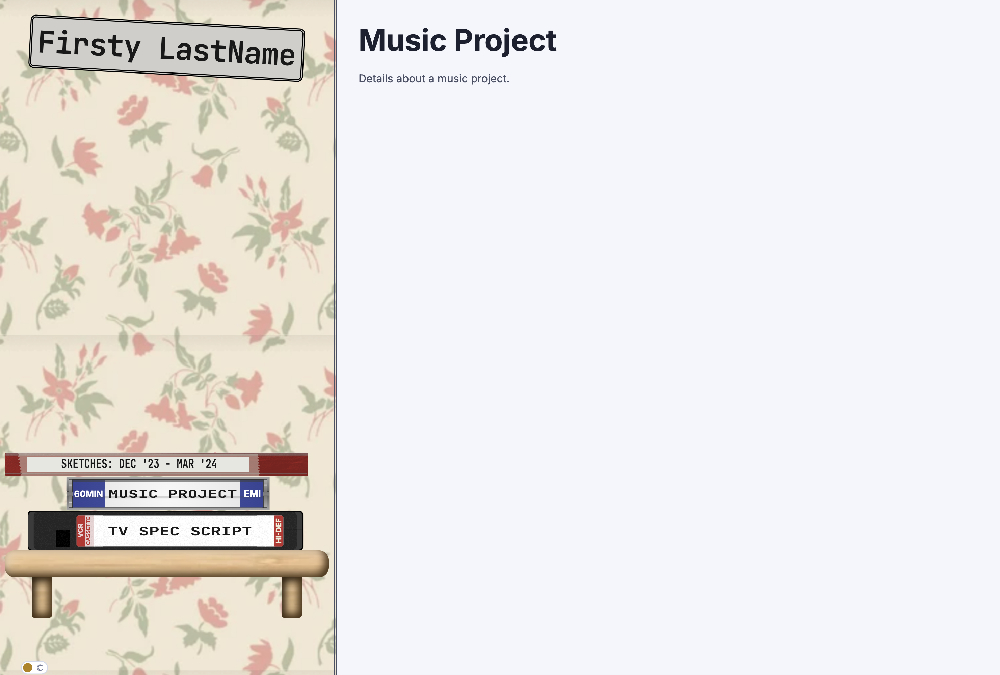
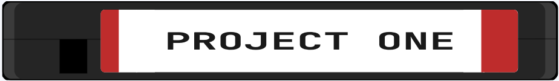

## Run demo site locally
```
bundle install
bundle exec jekyll serve --livereload
```


# jekyll-project-stack-portfolio

This theme is a little retro flavored and is designed to be a portfolio for projects, rather than a blog. It displays a stack of projects on the sidebar as a visual stack of VHS tapes, notebooks or (double) CD cases.


# Features

* Dark mode toggle
* Mobile friendly
* SEO friendly
* Sooo customizable you can spend so much time procrastinating

# Setup/Configure/Customize

There are a few things you need in place to get this theme working. The default Jekyll quickstart build will set you up with _posts directory. For this theme, you need to create a `_projects` directory in the root of your repository. Then add this to your `_config.yml` file:

``` yaml
collections:
  projects:
    output: true
    permalink: /projects/:name/

defaults:
  - scope:
      path: ""
      type: "projects"
    values:
      layout: "project"
```
This allows Jekyll to recognize markdown files in the `_projects` directory as a collection of project pages.

A project's stack style is set in the frontmatter of each project markdown page.

``` yaml
---
layout: project
type: vhs               #<---- makes this as a VHS tape in the stack
stack_style: tape    #<---- style class preset
title: "Sketches".      #<---- Text on the spine of the tape (and page title)
show_title: true.       #<---- show the title on the page (or not)
draft: false            #<---- if true, this project will not be displayed in the stack
---
```
#### type:

Valid values are `vhs`, `notebook`, `cd`. Up to you, maybe vhs for video projects, notebook for art or writing, cd for music.

#### stack_style:

There are a few built-in `stack_style` presets are defined in the plugin - `tape`, `notebook`, `cd`. And if you omit the stack_syle, the item will fall back to a plain default. Probably what you want to do, though, is create your own presets.

Make a new file in your repository at `_sass/_stack-presets.custom.scss` and copy the following into it:

``` css
// Stack style and color customization.
/*
    Name styles as a single word like .tape1
    In the project .md file set the stack_style to that value (no .) `stack_style: tape1`
    Tape color vars map to the VHS label bars from left to right.


*/
.tape1 {
  --tab_unlocked: 1; // 0 or 1 to set whether the VHS lock tab is removed
  --color1: #305198;
  --color2: #305198;
  --color3: #305198;
  --color4: #305198;
  --color5: #305198;

  --color6: #305198
  ;
}

.notebook1 {
  --notebook-color: #c74719;
  --label-color: #ffa008;
}

.cd1 {
  --color1: #5036f5;
  --color2: #12176a;
  --label-color: #f7f0e5;
}
```

Each class in that file is a preset that can be used in the frontmatter of a project markdown file.

You only need to specify the variables you want to override.

e.g.
```
---- project1.md ---

---
type: vhs
stack_style: redtape
title: "Project One"
---
...

---- _sass/_stack-presets.custom.scss ---

.redtape {
  --tab_unlocked: 0;
  --color1: #be2c2c;
  --color5: #be2c2c;
  --color6: #be2c2c;
}
```


Tape and cd also have additional style variables for extra decorative text on the label. see `_sass/_stack-presets.custom.scss` for some examples
